<div align="center">


# ⚡ Praktikum Data Engineering and Big Data Systems

### *Membangun Pipeline Data yang Scalable dan Reliable*

**Laboratorium Informatika**  
**Fakultas Teknik - Universitas Muhammadiyah Makassar**

---

[](https://github.com/devnolife)

</div>

---

## 📋 Informasi Mata Kuliah

| Atribut | Detail |
|---------|--------|
| **Kode Mata Kuliah** | `CW6552021549` |
| **Semester** | V (Lima) |
| **SKS** | 3 SKS |
| **Program Studi** | Informatika |
| **Fakultas** | Teknik |
| **Universitas** | Universitas Muhammadiyah Makassar |

---

## 📘 Deskripsi

> Sistem AI yang canggih tidak akan berguna tanpa data yang berkualitas dan alur kerja yang andal. Mata kuliah ini berfokus pada **siklus hidup data**: penyerapan (*ingestion*), penyimpanan, dan pemrosesan dataset skala besar menggunakan teknologi seperti **Apache Spark**, **Hadoop**, dan layanan data berbasis cloud.

## 🎯 Capaian Pembelajaran

<table>
<tr>
<td>

| No | Capaian |
|----|---------|
| 1 | Memahami **arsitektur big data** dan data pipeline |
| 2 | Menguasai **Apache Spark** untuk distributed computing |
| 3 | Mampu membangun **ETL pipeline** yang robust |
| 4 | Mengimplementasikan **data warehousing** dan data lake |
| 5 | Menggunakan **cloud services** untuk big data processing |

</td>
</tr>
</table>

## 📚 Roadmap Pembelajaran

> Materi dirancang untuk **8 pertemuan** dengan pendekatan *hands-on learning*

```mermaid
graph LR
    A[🌐 Big Data] --> B[📁 HDFS]
    B --> C[🗺️ MapReduce]
    C --> D[⚡ Spark]
    D --> E[🔍 SQL]
    E --> F[📡 Kafka]
    F --> G[🌊 Streaming]
    G --> H[🏆 Project]
```



| Pertemuan | Topik | Teknologi | Status |
|:---------:|-------|-----------|:------:|
| **01** | [Introduction to Big Data Ecosystem](./pertemuan-01) | Hadoop, Spark setup | 🟢 |
| **02** | [HDFS: Hadoop Distributed File System](./pertemuan-02) | HDFS operations, data ingestion | 🟢 |
| **03** | [MapReduce Fundamentals](./pertemuan-03) | Hadoop MapReduce, Word Count | 🟢 |
| **04** | [Apache Spark: RDD & DataFrames](./pertemuan-04) | Spark Core, RDD, DataFrames | 🟢 |
| **05** | [Spark SQL dan Data Manipulation](./pertemuan-05) | Spark SQL, query optimization | 🟢 |
| **06** | [Data Streaming dengan Kafka](./pertemuan-06) | Apache Kafka, Producer/Consumer | 🟢 |
| **07** | [Spark Streaming](./pertemuan-07) | Structured Streaming, real-time processing | 🟢 |
| **08** | [UTS: Mini Project Data Pipeline](./pertemuan-08) | End-to-end ETL pipeline | 🎯 |

## 🚀 Quick Start

### Prerequisites

<details>
<summary>📋 Klik untuk melihat System Requirements</summary>

**Required:**
- ✅ Java JDK 11+
- ✅ Python 3.8+
- ✅ Docker & Docker Compose (recommended)
- ✅ Git
- ✅ 8GB+ RAM
- ✅ 20GB+ disk space

**Recommended:**
- 🐧 Linux/macOS (atau WSL2 untuk Windows)
- 💻 IDE: VSCode, IntelliJ, PyCharm
- 🖥️ Terminal emulator

</details>

### 🐳 Docker Setup (Recommended)

```bash
# Clone repository
git clone https://github.com/devnolife/data-engineering-practicum.git
cd data-engineering-practicum

# Start services
cd docker
docker-compose up -d

# Verify
docker ps
```

<div align="center">

| Service | URL |
|---------|-----|
| 🔥 Spark UI | http://localhost:8080 |
| 📁 HDFS UI | http://localhost:9870 |
| 📡 Kafka UI | http://localhost:9000 |

</div>

<details>
<summary>🔧 Manual Setup (Advanced)</summary>

#### Install Hadoop
```bash
# Download
wget https://dlcdn.apache.org/hadoop/common/hadoop-3.3.6/hadoop-3.3.6.tar.gz
tar -xzvf hadoop-3.3.6.tar.gz
sudo mv hadoop-3.3.6 /usr/local/hadoop

# Configure environment
export HADOOP_HOME=/usr/local/hadoop
export PATH=$PATH:$HADOOP_HOME/bin:$HADOOP_HOME/sbin
```

#### Install Spark
```bash
# Download
wget https://dlcdn.apache.org/spark/spark-3.5.0/spark-3.5.0-bin-hadoop3.tgz
tar -xzvf spark-3.5.0-bin-hadoop3.tgz
sudo mv spark-3.5.0-bin-hadoop3 /usr/local/spark

# Configure environment
export SPARK_HOME=/usr/local/spark
export PATH=$PATH:$SPARK_HOME/bin
```

#### Install Python Dependencies
```bash
pip install pyspark kafka-python pandas numpy
```

</details>

---

## 📖 Panduan Penggunaan

### Workflow Setiap Pertemuan

```
📖 Baca README → 🔧 Setup Environment → 💻 Ikuti Tutorial → ✅ Submit
```

### Struktur Repository

```
📁 data-engineering-practicum/
├── 📄 README.md
├── 📁 docker/
│   └── docker-compose.yml
├── 📁 datasets/
│   └── sample-data/
├── 📁 pertemuan-01/
│   ├── 📄 README.md
│   └── 📁 [your-code]/
└── 📁 pertemuan-08/
    └── 📄 README.md (UTS Guidelines)
```

---

## 💻 Tech Stack

<div align="center">

### Core Technologies

| Technology | Purpose |
|:----------:|---------|
|  | Distributed storage & processing |
|  | Unified analytics engine |
|  | Event streaming platform |
|  | Distributed file system |

### Programming Languages

| Language | Purpose |
|:--------:|---------|
|  | PySpark, data processing |
|  | Alternative untuk Spark |
|  | Automation scripts |
|  | Data querying |

### Tools & Utilities

| Tool | Purpose |
|:----:|---------|
|  | Containerization |
|  | Interactive development |
|  | Version control |

</div>

---

## 📊 Sistem Penilaian

<div align="center">

```
┌─────────────────────────────────────────────────────────┐
│                    DISTRIBUSI NILAI                      │
├─────────────────────────────────────────────────────────┤
│  ████████░░░░░░░░░░░░░░░░░░░░░░░░░░░░░░░  10% Kehadiran │
│  ██████████████████████████░░░░░░░░░░░░░  30% Tugas     │
│  ████████████████████░░░░░░░░░░░░░░░░░░░  25% UTS       │
│  ██████████████████████████████░░░░░░░░░  35% UAS       │
└─────────────────────────────────────────────────────────┘
```

</div>

| Komponen | Bobot | Keterangan |
|----------|:-----:|------------|
| 📋 Kehadiran & Partisipasi | 10% | Minimal kehadiran 75% |
| 📝 Tugas Mingguan | 30% | Weekly Labs |
| 📊 UTS | 25% | Mid-term Project |
| 🎯 UAS | 35% | Final Project & Presentation |

### ✅ Kriteria Kelulusan

- [x] Nilai akhir minimal: **60 (D)**
- [x] Kehadiran minimal: **75%**
- [x] Mengumpulkan minimal **75%** tugas
- [x] Mengikuti UTS dan UAS

---

## 📝 Submission Guidelines

### Format Struktur Folder

```
📁 NIM_Nama_PertemuanXX/
├── 📁 code/
│   ├── ingestion/
│   ├── processing/
│   └── README.md
├── 📁 docs/
│   └── report.pdf
└── 📁 output/
    └── results/
```

### ✅ Checklist Sebelum Submit

- [ ] ✓ Code bisa di-run
- [ ] ✓ Documentation lengkap
- [ ] ✓ Screenshots/logs included
- [ ] ✓ Performance analysis
- [ ] ✓ Error handling implemented

---

## 🔧 Troubleshooting

<details>
<summary>❌ Out of Memory</summary>

```bash
# Increase Spark memory
export SPARK_DRIVER_MEMORY=4g
export SPARK_EXECUTOR_MEMORY=4g
```

</details>

<details>
<summary>❌ HDFS Connection Failed</summary>

```bash
# Check if services running
jps

# Restart HDFS
stop-dfs.sh
start-dfs.sh
```

</details>

<details>
<summary>❌ Kafka Not Starting</summary>

```bash
# Check Docker logs
docker logs kafka

# Restart services
docker-compose restart
```

</details>

---

## 📚 Referensi & Resources

<details>
<summary>📖 Official Documentation</summary>

| Technology | Documentation |
|------------|---------------|
| Apache Hadoop | [hadoop.apache.org](https://hadoop.apache.org/docs/stable/) |
| Apache Spark | [spark.apache.org](https://spark.apache.org/docs/latest/) |
| Apache Kafka | [kafka.apache.org](https://kafka.apache.org/documentation/) |

</details>

<details>
<summary>🎓 Learning Resources</summary>

- [Big Data University](https://cognitiveclass.ai/)
- [Databricks Academy](https://www.databricks.com/learn/training)
- [Confluent Kafka Tutorials](https://kafka-tutorials.confluent.io/)

</details>

<details>
<summary>📚 Recommended Books</summary>

- *"Hadoop: The Definitive Guide"* by Tom White
- *"Learning Spark"* by Holden Karau
- *"Designing Data-Intensive Applications"* by Martin Kleppmann

</details>

---

## 💡 Data Engineering Principles

<div align="center">

| 🎯 | Principle |
|:--:|-----------|
| 1️⃣ | **Data Quality > Data Quantity** |
| 2️⃣ | **Idempotent Pipelines** - Same input = Same output |
| 3️⃣ | **Monitor Everything** - Logs, metrics, alerts |
| 4️⃣ | **Test Early, Test Often** |
| 5️⃣ | **Document for Future You** |
| 6️⃣ | **Security First** - Encrypt, authenticate, authorize |
| 7️⃣ | **Fail Fast** - Catch errors early |
| 8️⃣ | **Scale Horizontally** - Add nodes, not resources |

</div>

---

## 👥 Tim Pengembang

<div align="center">

### 🏛️ Laboratorium Informatika
**Fakultas Teknik - Universitas Muhammadiyah Makassar**

---

| Role | Nama |
|------|------|
| 👨‍💻 **Developer & Maintainer** | [@devnolife](https://github.com/devnolife) |
| 👨‍🏫 **Dosen Pengampu** | [Nama Dosen] |
| 👨‍🔬 **Asisten Praktikum** | [Nama Asisten] |

</div>

---

## ⚠️ Catatan Penting

> [!WARNING]
> - **Backup data** sebelum run destructive operations
> - **Test on sample** before processing full dataset
> - **Plagiarism** akan mendapat sanksi
> - **Deadline** adalah hard deadline
> - Repository **terus diupdate** - pull regularly

---

<div align="center">

## 🚀 Let's Build Data Pipelines!

Mulai dari [**Pertemuan 01**](./pertemuan-01) dan bangun foundasi Big Data Engineering Anda!

**Welcome to the World of Big Data! 📊⚡**

---

### 📧 Kontak & Support

[](https://github.com/devnolife)
[](mailto:devnolife@gmail.com)

---

<sub>

**Laboratorium Informatika - Fakultas Teknik**  
**Universitas Muhammadiyah Makassar**  

---


**Last Updated:** December 2024 | **Version:** 2.0

Made with ❤️ by [devnolife](https://github.com/devnolife)

</sub>

</div>
